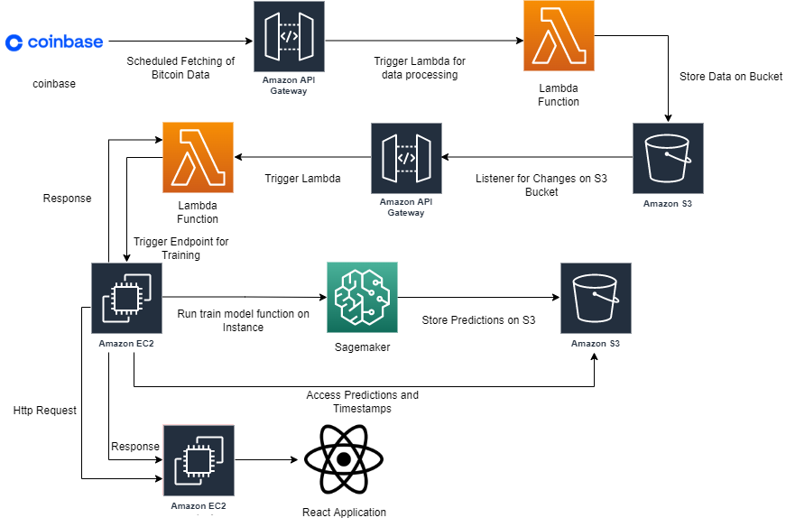

# Bitcoin Price Prediction

> Written by
> Khan Umer, Jaspreet Singh, Kinshuk Kotecha, Monesh Lalwani

This project aims to predict the Bitcoin (BTC) price prediction for 12 hours with data of 90 days of hourly data provided from Coinbase. We apply simple machine learning techniques on the data we scrapped and stored on certain AWS infrastructures to predict the value of BTC based on its historical data. 

Below is the diagram of our infrastructure used in the project.

## Access to Web Application

Our live bitcoin predictor can be accessed by the following link: http://54.236.231.229:3000/
